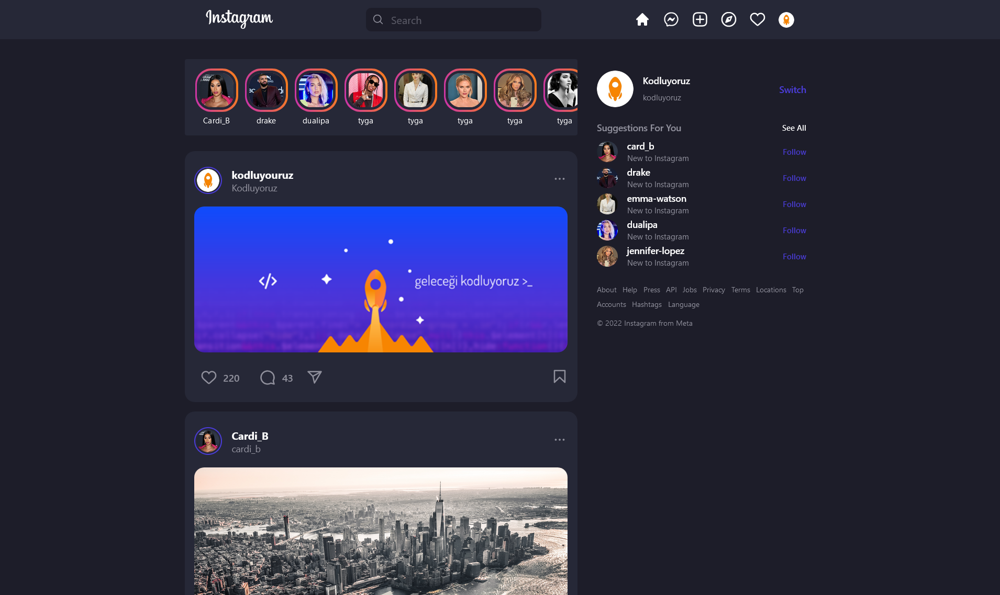

# Kodluyoruz Instagram Clone

## [Demo](https://kodluyoruz-instagram-clone.vercel.app/)


## Contributors
<div style ="margin-top:2rem; margin-bottom:2rem;"> 
<a href="https://github.com/ziarparvaiz/kodluyoruz-instagram-clone/graphs/contributors">
  
</a>

## Installation & Setup
If you haven't installed GulpJS first, you can install it [here](https://gulpjs.com/docs/en/getting-started/quick-start/).

```bash
git clone https://github.com/ziarparvaiz/kodluyoruz-instagram-clone.git
cd kodluyoruz-instagram-clone
npm install
gulp
```
